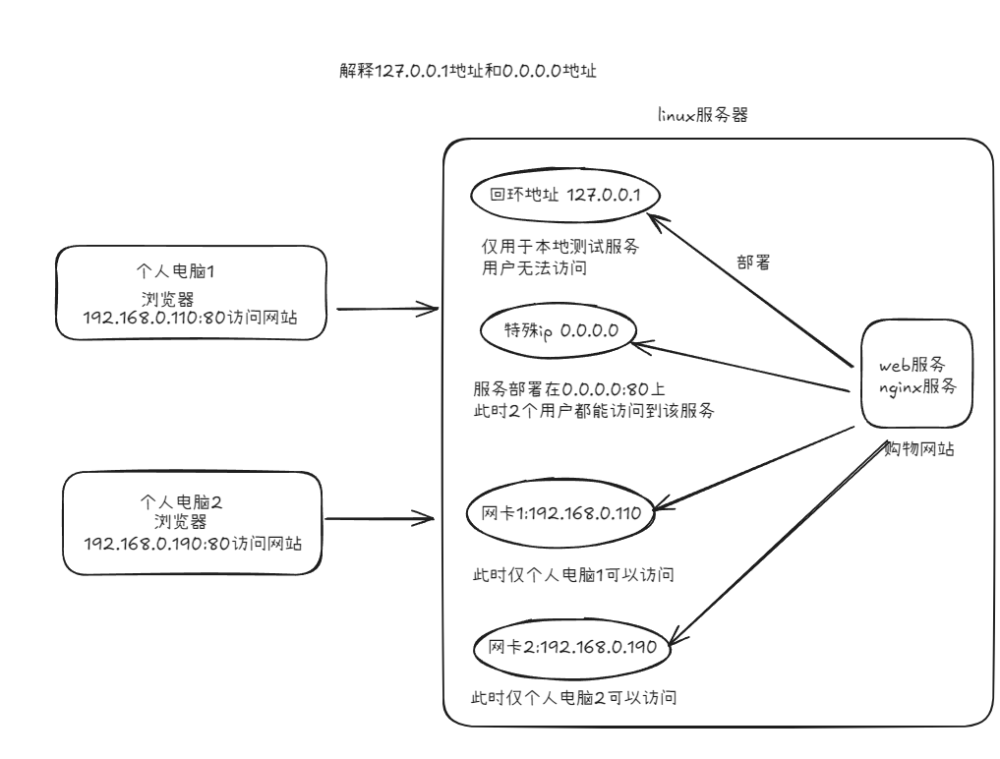
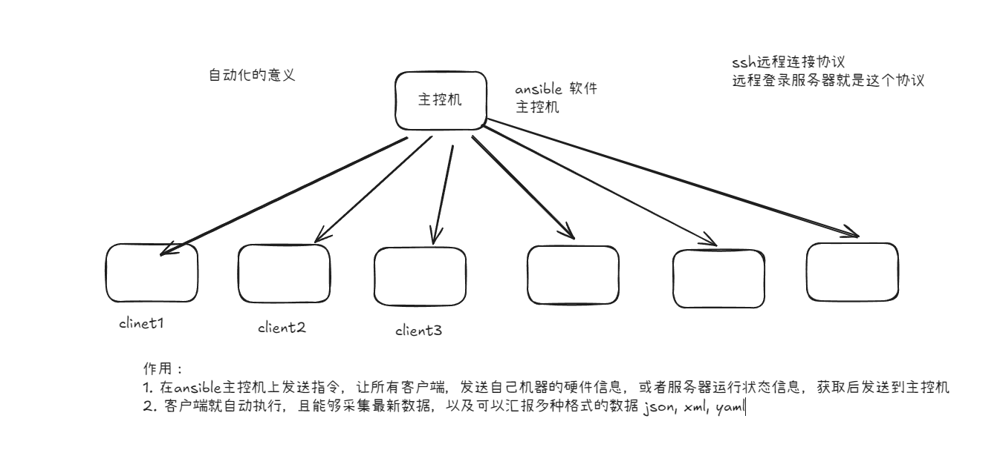
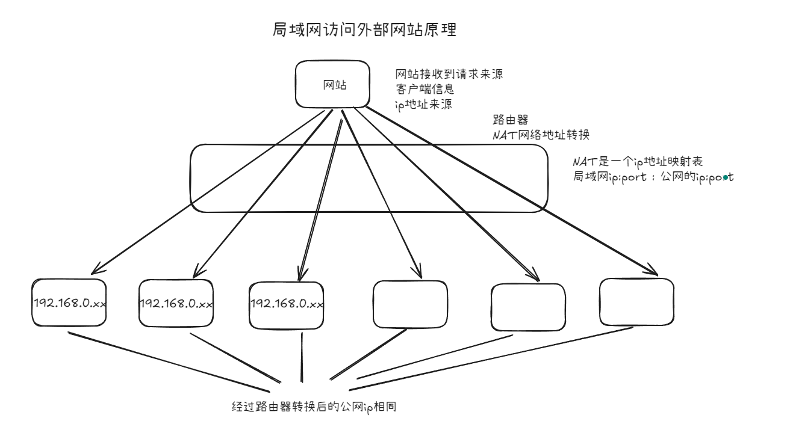

# 运维基本概念

## 机房（IDC）

对于IDC运维来说，大部分时间在机房中度过

### 服务器基本单位

磁盘阵列存储：多个硬盘通过技术组成一个整体高性能的硬盘集群

U的概念：U是表示服务器尺寸的单位，是unit的缩写
1U指的是服务器的厚度，固定是4.445cm

---

## 服务器的定义

广义：专门给其他机器提供服务的计算机

狭义：高性能计算机，通过网络为外部计算机提供一些业务服务

通常服务器内存是128g起步

硬件实体服务器大概4类：塔式服务器，刀片服务器，机式服务器，柜式服务器

---

## ip地址

特殊ip地址：

- 127.0.0.1
	- 回环地址
	- ip从127.0.0.0到127.255.255.255都将环回到本地主机中
	- 也就是发送的数据在电脑主机中绕圈
	- 一般用于程序运行在本地，测试访问本机的该程序
	- localhost本质是一个域名，通常与127.0.0.1绑定
- 0.0.0.0
	- 在服务器中指的是本机上的所有IPV4地址，如果一个主机有2个ip地址，且有一个服务监听地址为0.0.0.0:8080，那么2个ip地址都能访问该服务

程序部署的3种情况

1. 程序仅在本地运行，作为测试，运行在127.0.0.1:80 上
2. 服务器仅有1个网卡，假设ip为192.168.0.110，程序运行在192.168.0.110:80上
3. 服务器有多个网卡，可以将程序绑定在0.0.0.0:80上，**但是用户需要访问任意网卡的ip**

## 自动化技术的应用：

## 关于局域网 NAT

## 域名

任何连接到互联网的电脑都可以通过一个公共ip地址访问到，但是ip地址难以记忆，也容易变化
因此使用域名访问服务器，域名就是找到服务器位置的一串字母数字的组合，例如：www.bilibili.com

域名是不变的，ip是变化的

### 域名的规则

一个域名由多个部分组成，可以是一个或者多个部分组成，并用.分隔

**同时需要从右往左阅读**

> 当访问`taobao.com`时，服务器自动返回`www.taobao.com`，属于**nginx**部署的**url**重写机制

- 顶级域名TLD：通常表示服务类型
	- 表示公司或者企业`.com`
	- 表示提供网络服务的`.net`
	- 表示开源组织的`.org`
	- 表示政府网站`.gov`
- 买域名买的就是2级域名

可以通过腾讯云购买一个个人域名，同时可以在腾讯云中自己配置相关的域名解析服务

同样也可以自己搭建linux的域名解析服务（**bind**）

## 端口

